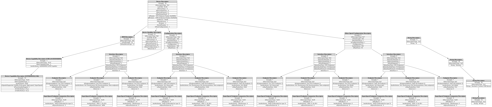

# Custom-QEMU-USB

This is a custom QEMU USB device with different endpoint types to test different functionality

To add and enable the custom USB device in your QEMU build:

1. **Create a submoudle**: Got to QEMU's `hw/usb/` directory and run the command:

```bash
git submodule add https://github.com/darshan-vayavya/Custom-QEMU-USB.git dusb
```

2. **Update Meson Build File**: Edit `hw/usb/meson.build`. Add:

```meson
system_ss.add(when: 'CONFIG_USBD', if_true: files('dusb/dusb.c'))
```

3. **Configure QEMU**: Ensure the **dusb** configuration is enabled. Create or edit **meson_options.txt** in the QEMU root if needed:

```meson
option('dusb', type: 'boolean', value: true, description: 'Custom DUSB device support')
```

4. **Configure QEMU**: Edit the meson.build script in your root folder and after:

```meson
#################
# config-host.h #
#################
config_host_data = configuration_data()
```

add:

```meson
if get_option('dusb')
  config_host_data.set('CONFIG_DUSB', true)
endif
```

5. **Configure QEMU**: Run the configure script with the device enabled:

```bash
mkdir -p build && cd build && ../configure --enable-dusb
```

6. **Build QEMU**: Compile QEMU:

```bash
make
```

7. **Run QEMU with Device**: Start QEMU with the device attached:

```bash
qemu-system-i386 -device usb-dusb
```

8. **Enable Logging (Optional)**: To see logs, run QEMU with logging enabled:

```bash
qemu-system-i386 -device usb-dusb -D dlog.txt -d usb
```

Logs will show device transactions in `dlog.txt`.

## Options

The custom USB devices comes with 2 options that can be set when adding device

1. `wakeup_interval` - The time in seconds when the System Wakeup is triggered - this is periodic. Default is **10** seconds. Works only when USB::REMOTE_WAKEUP is setup.
2. `in_interval` - The time interval between which the device sends IN transactions to the device - periodic. Default is **25** seconds. Works only when the ALT Interface is selected.

## Descriptors

The current USB device has the following descriptors



[Obtained from [usb-getdescriptor-visualizer](https://github.com/thisisthedarshan/usb-getdescriptor-visualizer) project's tools]
